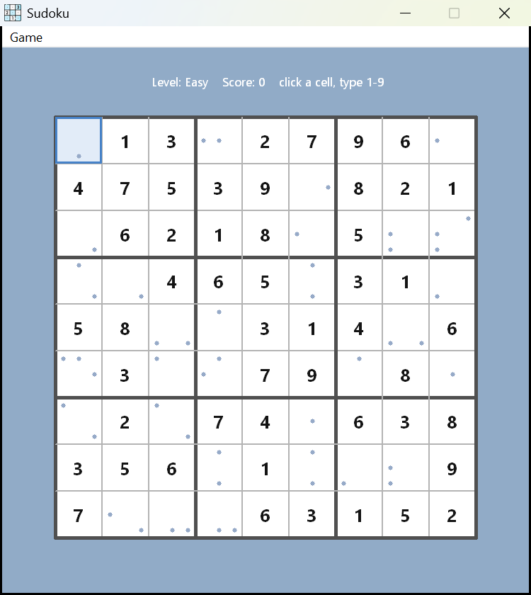
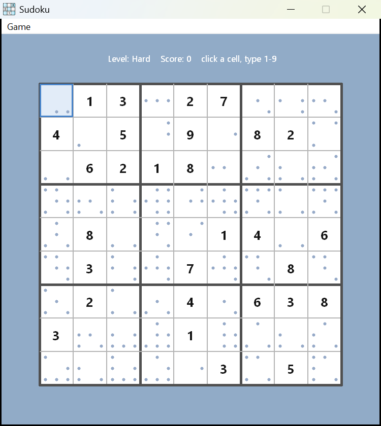
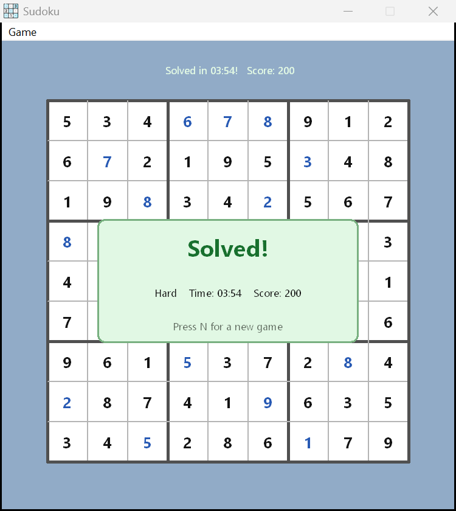

# Sudoku

A Sudoku game for Windows, written in C with the Win32 API (no frameworks). Every puzzle
is generated with a guaranteed **unique solution**, and input is validated against the
Sudoku rules (row / column / 3×3 box) rather than a stored answer.



## Features

- **Unique puzzles** — a full board is solved by randomized backtracking, then clues are
  removed one at a time; any removal that would allow a second solution is rolled back, so
  every puzzle has exactly one solution.
- **Three difficulties** — Easy / Medium / Hard differ in how many clues are removed
  (chosen from the `Game` menu).
- **Rule-based checking** — a digit that breaks a row, column or box is shown in red;
  there is no "mistake" counter and no guessing against the answer.
- **Pencil marks** — empty cells show a dot for every digit that is still a legal
  candidate, so you can reason about the board.
- **Peer highlighting** — the selected cell's row, column and 3×3 box are tinted, and
  any cell holding the same digit is highlighted more strongly, so it's easy to follow a
  line or spot a duplicate.
- **Timer** — elapsed play time is shown in the status line, frozen on a win, and carried
  through auto-resume.
- **Win detection** — the game is won when the board is full and no rule is violated; a
  "Solved!" overlay then shows the level, time and score, and **N** (or Enter / Space)
  starts a fresh game.
- **Auto-resume** — the current game is saved automatically and restored on the next launch.
- **High-DPI aware** — the window and all drawing scale with the display's DPI.
- **Crisp rendering** — double-buffered painting (no flicker) with grayscale
  anti-aliased text.

## How to build

With `make` (from `gui_sudoku/`):

```
make          # builds main.exe
make test     # builds and runs the model unit tests
make run      # builds and launches
make clean    # removes build artifacts
```

Without `make`, from `gui_sudoku/`:

```
windres -I include sudoku.rc -o sudoku_res.o
gcc -I include src/main.c src/sudoku.c src/sudoku_gui.c sudoku_res.o -o main.exe -mwindows
```

## How to run

```
./main.exe
```

### Controls

- **Click** a cell to select it, then **type 1–9** to place a digit.
- **0 / Backspace / Delete / Space** clears the selected cell.
- **Arrow keys** move the selection.
- **Game** menu: start a new puzzle at Easy / Medium / Hard, or Exit.
- **N / Enter / Space** (once solved) starts a new game at the same level.

## Testing

`make test` compiles `test/test_sudoku.c` against the pure model (`src/sudoku.c`) and runs
it. It checks solution counting (unique / ambiguous / unsolvable), the unique-solution
guarantee of `sudoku_generate`, the rule helpers, and difficulty ordering. The tests are
console programs with no Windows dependency.

## Architecture

The code is split into a dependency-free model and a thin Win32 view:

| File | Responsibility |
| --- | --- |
| `include/sudoku.h` / `src/sudoku.c` | Pure model: board rules, solution counting, and puzzle generation. No Windows types — testable on any platform. |
| `include/sudoku_gui.h` / `src/sudoku_gui.c` | Presentation: drawing the board (with peer / match highlighting), status line and play timer, pencil dots, the "Solved!" overlay, fonts, input handling, and save/resume. |
| `src/main.c` | Wires the two together: window class, message loop, DPI scaling, and the embedded icon. |
| `include/config.h` | Layout, colours, fonts, and the save-file path. |
| `sudoku.rc` / `app.manifest` | Embedded window/EXE icon and the DPI-awareness manifest (compiled with `windres`). |
| `test/test_sudoku.c` | Model unit tests. |

## Screenshots

Easy (denser givens) and Hard (fewer givens, more pencil-mark dots):

| Easy | Hard |
| --- | --- |
|  |  |

The "Solved!" overlay, shown when a board is completed:


